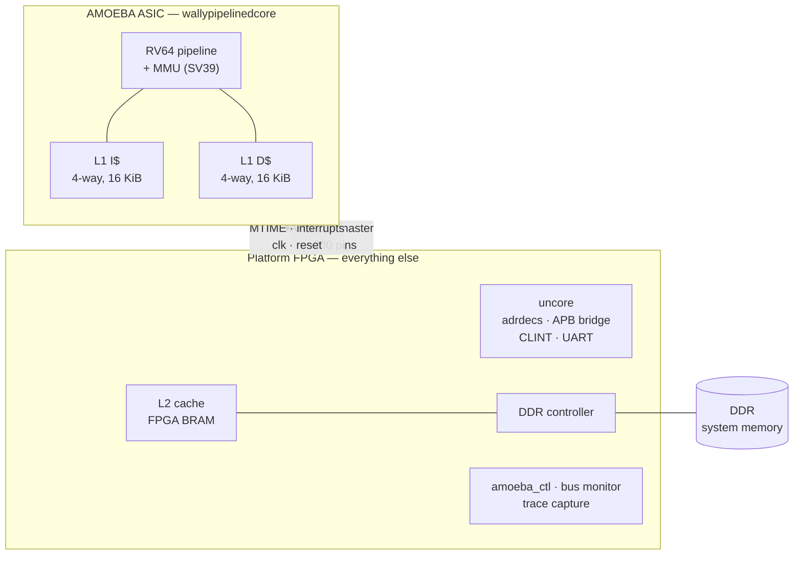
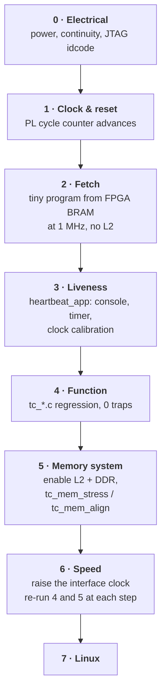

# Bringing the AMOEBA ASIC up on a platform FPGA

This is the plan for the silicon, written while the PYNQ work is fresh, because
the PYNQ work **is** the rehearsal and the value of a rehearsal decays if you
don't write down which parts were the performance.

The short version: the chip we tape out is a CPU core and nothing else. Every
other thing a running system needs — memory, timer, console, interrupt
controller — lives on a platform FPGA next to it. That is not a compromise
forced by area; it is what makes bring-up tractable, because **everything
outside the chip stays editable after tape-out.**

---

## 1. What the ASIC actually is

The tape-out boundary is `wallypipelinedcore`, not `wallypipelinedsoc`. That
distinction is the single most important fact on this page, so here is the
whole external surface of the chip:

| Group | Signals | Dir | Width |
|---|---|---|---|
| Clock / reset | `clk`, `reset` | in | 2 |
| Interrupts | `MTimerInt`, `MExtInt`, `SExtInt`, `MSwInt` | in | 4 |
| Timer value | `MTIME_CLINT` | in | **64** |
| Bus — address | `HADDR` | out | **56** |
| Bus — write data | `HWDATA` | out | **64** |
| Bus — write strobes | `HWSTRB` | out | 8 |
| Bus — control | `HWRITE`,`HSIZE`,`HBURST`,`HPROT`,`HTRANS`,`HMASTLOCK` | out | 14 |
| Bus — clock/reset out | `HCLK`, `HRESETn` | out | 2 |
| Bus — read data | `HRDATA` | in | **64** |
| Bus — response | `HREADY`, `HRESP` | in | 2 |
| Debug | `ExternalStall` | in | 1 |

**281 signal pins**, before a single power or ground pad.

The core contains its L1 caches (I and D, each 4 ways × 4 KiB with 64-byte
lines) and its MMU. It contains no memory, no CLINT, no UART, no PLIC — those
are `_SUPPORTED = 0` in `config_baremetal_linux` or live in the uncore we are
not taping out.

So the chip's entire relationship with the world is: **one AHB-Lite master, a
timer value, four interrupt lines, and a clock.**



---

## 2. The pin budget, and what it forces

**The budget is 52 pads total** — signal, power, ground and DFT. The naive
boundary in §1 is 281 signal pins. So the interface in §1 is not a starting
point to trim; it is a thing that has to be replaced wholesale.

At 1 mm² on 65 nm there is also no room to spend area buying pins back, which
rules out the usual escape of widening on-die buffering to shorten bursts.

### The budget

Working numbers, to be replaced with the real pad ring once the PDK IO cells
and the current draw are known:

| Group | Pads | Notes |
|---|---:|---|
| Core VDD | 3 | 1 mm² of 65 nm digital at bring-up speeds |
| IO VDD | 3 | separate supply; bidirectional pads switch hard |
| GND | 5 | core and IO, SSN on the data bus is the driver |
| **Power / ground** | **11** | |
| DFT | 5 | `test_mode`, `scan_en`, `scan_in`, `scan_out`, plus one spare |
| Clock | 1 | supplied by the FPGA; no on-die PLL at this size |
| Reset | 1 | active low, FPGA-owned — see §5 |
| **Fixed overhead** | **18** | |
| **Left for the bus** | **34** | |

### What fits in 34

A bidirectional data bus with a small control group:

| Width | Data | Control | Total | Fits? |
|---|---:|---:|---:|---|
| 16-bit bidir | 16 | 4 | 20 | yes, 14 pads spare |
| 32-bit bidir | 32 | 4 | 36 | **no** — 2 over, before any spare |

So **16 bits bidirectional** is the natural width, and it leaves real margin
for extra DFT chains, a second reset domain, or an observability pin. A 32-bit
bus only fits by cutting DFT to a single chain and running with zero spare
pads, which is a bad trade on a first tape-out.

Control group, nominally four pins — the exact protocol is being defined:

| Pin | Direction | Purpose |
|---|---|---|
| `req` | ASIC → FPGA | transaction start / beat valid |
| `ack` | FPGA → ASIC | ready / return-beat valid |
| `dir` | ASIC → FPGA | who drives the data bus this beat |
| `cmd` | ASIC → FPGA | header beat vs. data beat |

`dir` and `cmd` are both derivable from a shared state machine, so a
three-pin or even two-pin control group is possible. Keep them explicit for
the first tape-out: an unambiguous bus is worth two pads when the alternative
is a bring-up failure you cannot see into.

### Serialization removes the addressability problem

This is worth stating plainly because it changes what the FPGA-side MMU is
*for*.

Once the bus is narrow and packetized, **address width costs time, not pins.**
A 32-bit address is two beats. Against a 64-byte cache line — 32 data beats —
that is a 6% overhead, and compressing the address to save one of those beats
buys 3%.

So the off-chip interface is not addressability-limited in any real sense. Do
not spend design complexity compressing addresses. Send the full physical
address and let the FPGA do whatever mapping it wants on the far side.

### What the second-order MMU is actually for

Given the above, the FPGA-side translation layer earns its place on three
things that have nothing to do with pin count:

1. **Relocation.** The ASIC believes its memory starts at `0x8000_0000`; the
   FPGA can put it anywhere in DDR, including moving it between runs.
2. **Protection.** Bound the ASIC's reach so a runaway address cannot leave
   its window. We have already had to build exactly this on the PYNQ, in RTL,
   because the block design could not express it — see `amoeba_pynq_top.sv`,
   where the address is masked to `EXT_MEM_RANGE` before the carve-out base is
   OR-ed in, making escape structurally impossible. Do the same thing here,
   and do it on the FPGA where it stays editable.
3. **Observability.** Every off-chip transaction passes through it, so it is
   the natural place to log, trap on a range, or count misses — the ASIC
   equivalent of `amoeba_bus_mon`.

### Transaction cost

| Item | Beats |
|---|---:|
| Header (command + 32-bit address) | 3 |
| 64-byte cache line | 32 |
| **Line fill or writeback** | **35** |
| Uncached 8-byte access | 3 + 4 = 7 |

If the IO clock and the core clock are the same, a cache miss costs ~35 core
cycles — which is in the same range as a DRAM access on a real part, so the
core's stall behaviour during bring-up will not be wildly unrepresentative.
**This is the number that makes the FPGA-side L2 in §3 matter:** it absorbs
DDR latency so that the 35-beat crossing is the only cost a miss pays.

### The on-die wrapper

`wallypipelinedcore` speaks AHB-Lite with a 64-bit data path. Something on-die
has to turn that into the narrow packet protocol:

- an AHB-Lite **slave** facing the core's master
- a serializer/deserializer to the 16-bit bidirectional bus
- back-pressure: hold `HREADY` low for the duration of the packet exchange,
  which is the whole reason the core tolerates a slow interface at all
- a single 64-bit staging register is enough — the AHB hands over one 64-bit
  beat at a time, so there is no need to buffer a whole line on-die

This wrapper is new RTL, it is on the critical path to first silicon, and it
is the one block with no FPGA rehearsal behind it. It should be the first
thing written and the most heavily verified — including against the same
`tc_mem_stress` / `tc_mem_align` workloads, by standing it up in the PYNQ
design in place of the current AHB path.

### Moving the CLINT on-die is not optional

At 52 pads it is forced, and the reasoning is worth following because it is
not the obvious one.

**It is not a config flag.** `CLINT_SUPPORTED` is already `1` in
`pkg/config_baremetal_linux.vh`. What it controls is whether `clint_apb` is
instantiated inside `uncore.sv` — and the uncore is *outside* our tape-out
boundary. So moving the CLINT on-die means **moving the boundary**, to
something between `wallypipelinedcore` and `wallypipelinedsoc`:

```
  wallypipelinedcore          ← today's boundary
  + clint_apb                 ← the timer itself
  + ahbapbbridge              ← 105 lines, to reach it
  + adrdecs (partial)         ← enough to generate HSELCLINT
```

**The decisive argument is that you need an on-die 64-bit counter either way.**
`wallypipelinedcore` takes `MTIME_CLINT[63:0]` as a *parallel input*. Over a
serial bus that value has to be reconstructed on-die into a shadow counter —
which is already most of a CLINT. Given that, build the real one and get spec
compliance for free.

**Area is not the constraint.** `clint_apb` is MTIME (64 flops), MTIMECMP (64
flops), MSIP (1 flop), a 64-bit incrementer, a 64-bit comparator and an APB
read mux. Order 2k gate-equivalents; at 65 nm that is roughly 0.004 mm², about
0.4% of the die. Allow a few times that for the APB bridge, decode and
routing and it is still comfortably ≤2%. Treat these as order-of-magnitude
until a real library is in hand.

**It also removes a whole class of software bug.** With the CLINT on-die and
clocked by the core clock, MTIME advances once per core cycle by construction,
so `configCPU_CLOCK_HZ` is exactly the core clock — see §7 for why that
constant has historically been the easiest thing in this system to get wrong.
The caveat is that RISC-V expects `mtime` at constant frequency, so anything
that varies the core clock later (DVFS) changes it; irrelevant during
bring-up, worth writing down now.

**What stays off-chip:** the UART, and the PLIC if it is ever enabled. Both
are addressed over the same bus as memory, so they cost no pins, and both stay
editable in the FPGA — which is exactly where you want the console when the
chip will not talk.

### Where `mtime` starts — there is nothing to load

`clint_apb` resets `MTIME` to zero and increments it once per `PCLK`
thereafter. That is correct and complete: **`mtime` is a monotonic tick
counter since reset, not a wall clock.** Nothing in the privileged spec,
FreeRTOS or Linux expects it to hold real time — Linux takes wall-clock time
from an RTC or from the boot protocol and uses `mtime` only for *elapsed*
time. So the chip comes out of reset with the correct value by construction,
and no initialisation step is needed.

It *is* writable, if you ever want it: a memory-mapped store to
`CLINT_BASE + 0xBFF8`, byte-granular through the write strobes. But note who
can perform that store — see below — and that on this design it can only ever
be the ASIC's own software.

One property falls out for free and is worth exploiting. The FPGA owns reset,
the whole chip is on one clock, and `mtime` starts at zero. So **the FPGA's own
free-running counter and the ASIC's `mtime` start together and stay in exact
lockstep** — no drift, no sampling error. That turns the clock cross-check in
§7 from a statistical comparison into an exact one: any divergence is a bug,
not measurement noise.

### The FPGA cannot initiate anything

This follows from the ASIC having only a bus *master* and no slave, and it
shapes the whole debug story, so it is worth stating baldly:

> The FPGA's only influences on the ASIC are **reset**, **the clock**, **the
> data it returns to ASIC-initiated requests**, and **scan**.

There is no host-initiated read of ASIC state over the functional interface.
No poking a CSR, no reading memory behind the core's back, no injecting an
interrupt.

Three consequences:

1. **The existing test infrastructure survives intact**, because all of it is
   ASIC-initiated. HTIF `tohost` is the core writing to a magic address and
   the FPGA snooping it; the console is the core writing to the UART. Both
   work unchanged. This is the strongest single argument for keeping the §6
   stack as-is.
2. **The FPGA controls the first instructions the chip ever executes**, since
   it answers the reset-vector fetch. That is the one injection point, and it
   is a powerful one — a bring-up "program" can be handed to the core without
   any loader on either side.
3. **Scan is the only host-initiated observation path.** Which makes the
   scan-chain decision a debug decision, not just a manufacturing-test one.

### Scan chains as the debug path

One or two chains, with CSR readout as a first-class goal. Four things worth
fixing early, because they are nearly free now and expensive later:

**Put the CSRs at the front of the chain.** Nearest `scan_out`, so architectural
state can be recovered by shifting a few hundred bits instead of dumping tens
of thousands. This is a constraint on chain stitching, it costs nothing, and
without it every CSR read costs a full-chain dump.

**Write down the chain map.** A bit-position-to-signal table, generated from
the DFT flow rather than hand-maintained. Without it a dump is undifferentiated
soup. This is the same failure mode `check_regs.py` exists to prevent on the
register map, and it deserves the same treatment: generated, and checked.

**Know that scan does not see SRAM.** Cache data and tags live in macros, not
scan flops, so a dump gives pipeline state, CSRs and control FSMs — not cache
contents. If cache state matters for a bug, it has to be reached some other
way (a software walk, or a debug read port).

**Decide whether dumps are destructive.** Shifting out shifts something in.
Either shift the pattern back around to preserve state and continue, or accept
scan as post-mortem only. For bring-up, post-mortem is usually enough and much
simpler — but decide it rather than discover it.

Shift cost, for calibration: at ~25k scan flops and two chains, a full dump is
~12.5k shifts per chain — well under a millisecond at any plausible shift
clock. Depth is not the constraint; knowing what the bits mean is.

### Always answering, and what replaces the error path

Tying the response to always-OK is the right call — an error protocol defined
before first silicon would be guesswork, and a slave that can refuse is a slave
that can hang the core. It removes the worst failure mode: an access that never
completes, which on a bus with no timeout is unrecoverable.

What it costs is that a bad address now returns *plausible* data instead of
trapping. Two cheap things put that visibility back, both on the FPGA side
where they stay editable:

- **Return poison, not zeros,** for anything outside the ASIC's window — a
  recognisable pattern like `0xBAADC0DE_DEADBEEF`. Zeros look like legitimate
  data in a dump and silently do the wrong thing; poison announces itself in a
  trace, a memory dump, or a register value.
- **Count and log out-of-window accesses anyway.** The second-order MMU answers
  the request *and* records it. This is the observability role from earlier in
  this section, and it is what turns "the test gave the wrong answer" into "the
  core made 4,102 accesses it should not have, starting at this address."

Add one more thing the error path used to provide implicitly: **a
no-request watchdog.** If the ASIC issues no bus transaction for N cycles it is
either wedged or in a tight cache-resident loop, and the FPGA is the only thing
that can notice. That is the ASIC-side equivalent of the `cycles` / `retired`
ladder in §8, and it should exist before the first power-on.

## 3. Where the memory lives, and why

```
       ON THE ASIC                    ON THE FPGA
  ┌──────────────────┐      ┌────────────────────────────────┐
  │  L1 I$   16 KiB  │      │  L2 cache        BRAM          │
  │  L1 D$   16 KiB  │ ───► │  256 KiB – 1 MiB               │ ───► DDR
  │  4-way, 64 B     │ AHB  │  direct-mapped or 4-way        │      512 MiB
  │  write-back      │      │  64 B lines, inclusive         │
  └──────────────────┘      └────────────────────────────────┘
     ~1 cycle                  ~10–20 cycles                    ~40–80 cycles
```

**The L1s are fixed in silicon.** 4 ways × 4 KiB is not an arbitrary choice: a
VIPT L1 needs way size ≤ page size, and SV39 pages are 4 KiB. Going wider per
way would force physical tagging or page-colouring. So the L1 geometry is
settled and the only lever left is L2.

**The L2 in BRAM is the interesting piece,** and it exists for a reason beyond
performance: it is the last layer that stays editable after tape-out. If the
silicon's L1 turns out to have a coherence or eviction bug, an FPGA-side L2 is
where you work around it. Budget it generously — a Zynq-class part has
BRAM to spare once the core is no longer in fabric.

**A design note that matters for the L2:** the ASIC's L1 is write-back and
write-allocate, so what arrives at the L2 is almost entirely **whole 64-byte
lines** — burst fills and burst writebacks. Sub-word writes essentially never
appear on the bus. We proved this on the PYNQ build by breaking the byte-enable
path deliberately and watching every test still pass. So the L2 should be
optimized for full-line traffic, and its byte-enable path needs its own
directed test rather than relying on software to exercise it.

---

## 4. Address map — three spaces, kept distinct

The same discipline as `fpga/pynq/DESIGN.md`, with one more layer because the
FPGA now has its own DRAM rather than borrowing a PS's.

| Space | Seen by | Contents |
|---|---|---|
| **Core PA** | the ASIC | CLINT `0x0200_0000`, UART `0x1000_0000`, EXT_MEM `0x8000_0000`–`0x8FFF_FFFF` |
| **FPGA fabric** | the platform design | L2 ports, `amoeba_ctl`, trace buffer, DDR controller |
| **Host** | whatever drives bring-up | control block, image window, trace readout |

Everything the core can emit fits in 32 bits, which is why `HADDR[55:32]` is
free to drop. **Do check this against the linker scripts rather than assuming
it** — that is exactly the class of mistake that produced a real defect in the
PYNQ AXI path, where the RTL passed a 56-bit address straight through to a
32-bit bridge port with no translation at all.

---

## 5. Clocking and reset: the chip-crossing problem

This is the part with no FPGA-only analogue, and the part most likely to eat a
week.

AHB-Lite is a **synchronous bus with combinational handshakes**. In the same
die, `HREADY` and `HRDATA` come back within a cycle. Across a package boundary
you now pay, on every single transfer:

```
   core clk edge ──► HADDR out of the ASIC pad     (clk-to-Q + pad delay)
                 ──► board trace to the FPGA        (flight time)
                 ──► FPGA input pad + routing       (setup at the L2)
                 ──► L2 decides HREADY
                 ──► FPGA output pad + trace back
                 ──► ASIC input setup               ◄── all inside ONE cycle
```

That round trip is what sets the maximum clock, and it will be **far** below
what the silicon can do internally. Plan for it in three stages:

**The whole chip is on one clock**, which settles most of this: no CDC
anywhere on the die, `mtime` advances once per core cycle, and the 35-beat
packet exchange costs 35 core cycles. What remains is choosing how fast that
single clock can go, which is exactly the round trip drawn above.

1. **Slow synchronous.** A few MHz, everything comfortably inside one period.
   Ugly and correct. This is where bring-up starts, and the FreeRTOS suite
   runs fine here — our whole regression is ~700k cycles, which is under a
   second even at 1 MHz.
2. **Registered AHB.** Add a pipeline stage each way on the FPGA side. Doubles
   latency in cycles, but each cycle can be much shorter. Needs the core to
   tolerate more wait states, which it does — `HREADY` already gates it.
3. **Source-synchronous.** The ASIC forwards a clock with its outputs; the
   FPGA captures on that. Standard technique, real effort, only worth it once
   the design is known-good.

**Do not design for stage 3 first.** Every hour spent on interface speed before
the core is known to execute correctly is an hour spent debugging two things at
once — which is the same argument that put FreeRTOS-on-DDR before Linux-on-DDR
in the current plan.

**Reset.** The FPGA owns the ASIC's reset, exactly as the PS owns the soft
core's reset today. That single fact is what makes the whole load-then-run
model work: the host can write memory while the core is guaranteed quiescent,
with no arbitration anywhere.

---

## 6. What carries over unchanged — the actual payoff

This is why the PYNQ effort matters beyond the PYNQ.

| Component | Status on the ASIC platform |
|---|---|
| `amoeba_ctl` register block | **unchanged** — same 21 offsets, same `AMOB` magic |
| `amoeba_bus_mon` + HTIF `tohost` | **unchanged** — snoops AHB, same exit protocol |
| `amoeba_trace` | **unchanged** — same commit-record path |
| `sw/amoeba/` driver | **mostly** — swap `Mmio` for the new host transport |
| `check_regs.py` | **unchanged** — still asserts RTL vs driver agreement |
| FreeRTOS suite (`tc_*.c`) | **unchanged** — including the two memory tests |
| Linker scripts | **new one**, same shape as `freertos_pynq_ddr.ld` |
| `heartbeat_app.c` | **unchanged** — and it is the first thing you run |
| `ahb_to_memitf` / BRAM backend | replaced by the L2 |

The rule that makes this hold: **keep the AHB-facing structure identical.** The
bus monitor, the control block and the trace tap all attach to the AHB, and the
AHB is the one thing the ASIC boundary guarantees. As long as the platform
FPGA presents that bus the same way the PYNQ fabric does, the entire
observability and test stack is a recompile rather than a rewrite.

Concretely, that means the platform FPGA should instantiate the *same*
`amoeba_ctl`, `amoeba_bus_mon` and `amoeba_trace` sources, not reimplementations.

---

## 7. The one software constant that will bite you

`configCPU_CLOCK_HZ` must equal the clock the core actually runs at, because
CVW's CLINT increments MTIME once per clock and the FreeRTOS port derives
`mtimecmp` steps from that constant. Get it wrong and **every terminating test
still passes** — they check ordering and results, not rates — while every
interval in the system is off by the ratio.

We hit exactly this on the PYNQ (a design timing-closed at 25.5 MHz running
against a 100 MHz boot default), and the only thing that caught it was
`heartbeat_app.c` measuring beat period against host wall time.

On the ASIC platform the bring-up clock will be *unusual* — a few MHz, and
possibly not a round number. So:

- make `configCPU_CLOCK_HZ` a build parameter from the start (it already is)
- run `heartbeat_app.c` **before** anything else, and check its calibration line
- carry the same cross-check: guest timer vs. a free-running fabric counter

The same trap has a Linux-side twin: `timebase-frequency` in the devicetree.

---

## 8. Staged bring-up

Each stage has one pass criterion. Do not proceed on a partial pass.



**Stage 2 is the one to design for now.** It wants a small FPGA-BRAM memory
directly behind the AHB with no L2 in the path — the exact role
`amoeba_mem_bram` plays today. Keep that block; it is the simplest possible
backend and therefore the right one to bisect against when the L2 misbehaves.

**Stage 5 is where the memory tests earn their place.** `tc_mem_stress` walks a
working set past the cache in four different access orders with address-derived
values, so a dropped burst beat or a mistranslated address bit is caught and
named. Put its working set high in DRAM — confined to low addresses, the upper
address bits never toggle and a bridge that drops one goes unnoticed.

The diagnostic ladder from `run_freertos.py` transfers directly:

| reading | conclusion |
|---|---|
| `cycles` = 0 | not clocked, or reset never released |
| `cycles` > 0, `retired` = 0 | fetching but nothing commits — image, reset vector, or the bus never completes |
| `retired` > 0, `traps` > 0 | trapping in a loop |
| all advanced, no `tohost` | ran fine, exit never seen — check the `tohost` address agreement |

---

## 9. What the FPGA rehearsal cannot prove

Worth stating so nobody mistakes a green regression for a working chip:

- **IO timing across the package** — the whole of §5
- **Power sequencing and integrity** — droop under a cache-miss burst
- **PVT spread** — the FPGA runs at one corner
- **Hold violations** — an FPGA build fixes them silently; silicon does not
- **Clock tree and skew** — synthesized differently in both flows

The FPGA proves the *logic*. Everything above is proven only on the bench, and
it is the reason stage 0 and stage 1 exist as separate steps with their own
pass criteria.

---

## 10. Decisions

### Settled

| Decision | Answer | Why |
|---|---|---|
| `MTIME_CLINT` — 64 pins, serialized, or on-die? | **CLINT on-die** | forced at 52 pads; and a shadow counter would be most of a CLINT anyway (§2) |
| Shared or split data bus? | **shared, bidirectional** | split does not fit (§2) |
| Bus width | **16 bits** | 32 does not fit alongside DFT and any spare (§2) |
| Does `HADDR` leave the chip at 32 bits or 56? | **neither — serialized** | address costs time, not pins, once packetized (§2) |
| Tape-out boundary | **core + CLINT + APB bridge + partial decode** | follows from the CLINT decision |
| Clock domains | **one, whole chip** | no CDC on die; `mtime` = core cycles |
| Error / response protocol | **FPGA always answers, no error path** | an error protocol guessed before silicon is worse than none; poison + logging replaces it (§2) |
| Host-initiated debug | **scan only** | the ASIC has no bus slave (§2) |
| `mtime` initialisation | **none needed** | resets to 0; it is a tick counter, not a wall clock (§2) |

### Open

1. **The IO protocol itself** — beat encoding, whether `dir`/`cmd` collapse
   into the state machine, burst vs. strict request-response, and error
   signalling. Everything in §2 assumes a nominal 4-pin control group; the
   real one may be smaller.
2. **Scan chain stitch order and the chain map.** 1–2 chains is settled;
   what is not is whether the CSRs are stitched to the front and who owns the
   generated bit map (§2). Both get much harder to change after DFT insertion.
3. **Is a scan dump destructive, or does state shift back around?** (§2)
4. **L2 geometry and policy** — size, associativity, write policy, inclusion
   (§3). Bounded below by DDR latency and above by FPGA BRAM.
5. **Which platform FPGA?** Now much easier than it looked: at ~20 signal pins
   the IO count is trivial for any part, so the choice is driven purely by
   BRAM for the L2 and by DDR availability.
6. **Power and ground pad count** — the §2 table is a placeholder until the
   real current draw and the PDK's IO cells are known. It is the one number
   that can eat the spare pads.

## Appendix — bringing the same discipline forward

Three habits from the PYNQ bring-up that paid for themselves and should be
carried over verbatim:

- **`check_regs.py`.** The register map has no compile-time link between RTL
  and driver. A parser that asserts they agree turns a class of silent
  wrong-answer bugs into a startup error.
- **Measure the clock, do not read it back.** `check_fclk()` counts real cycles
  against host wall time. Reading a config register back only proves the write
  landed.
- **Prove a test can fail.** Both memory tests were validated by injecting the
  bug they target and confirming they caught it — and one of them *didn't*,
  which is how we learned the byte-enable path is untestable from software. A
  test never seen to fail is not evidence.
