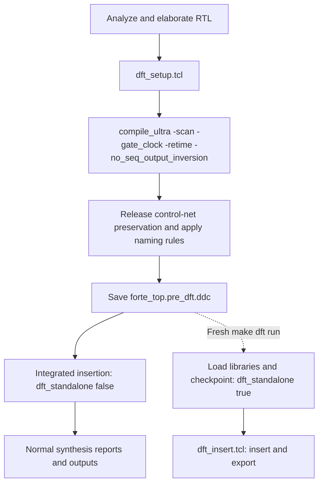

# DFT flow

## Purpose and scope

The flow inserts eight scan chains at `forte_top`, through the ASIC pad ring: chain `c<k>` runs from `io_in[k]` to `io_out[k]`. `DFT_SCOPE` (environment, default `pc`) picks what goes on them:

| `DFT_SCOPE` | Scanned state | Bench |
|---|---|---|
| `pc` | The fetch-stage program counter, PCF (63 cells) | `scripts/pc_tb/` |
| `full` | PC, pipeline stage registers and hardened CSRs (about 1,300 cells) | `scripts/full_tb/` |

Internal objects are identified before compilation. A mapped, pre-insertion DDC checkpoint allows insertion to be repeated without rerunning synthesis or searching for renamed registers and control gates.

The flow does not implement cache MBIST or ATPG pattern generation, and it makes no RTL changes. The benches in `scripts/` verify the inserted chains at gate level; see `scripts/HANDOFF.md` for the full hand-off notes.

## Files and execution order

| File | Role |
|---|---|
| [synthesis.tcl](synthesis.tcl) | Reads RTL, runs DFT setup, compiles, saves the prepared checkpoint, and runs integrated insertion |
| [dft_procs.tcl](dft_procs.tcl) | Shared procs: `dft_bind_hookups` (Q/QN-aware control hookups) and `dft_write_phase` (per-cell logical phase) |
| [dft_setup.tcl](dft_setup.tcl) | Selects the scan registers for `DFT_SCOPE`, identifies test signals before compilation and applies scan/preservation attributes |
| [dft_insert.tcl](dft_insert.tcl) | Configures chain connections, runs DFT DRC and insertion, and exports scan information |
| [Makefile](Makefile) | Exports `DFT_SCOPE` (`make synth DFT_SCOPE=full`) and provides `make dft` to reload the checkpoint in a fresh DC session |


```mermaid
flowchart TD
    A[Analyze and elaborate RTL] --> B[dft_setup.tcl]
    B --> C[compile_ultra -scan -gate_clock -retime -no_seq_output_inversion]
    C --> D[Release control-net preservation and apply naming rules]
    D --> E[Save forte_top.pre_dft.ddc]
    E --> F[Integrated insertion: dft_standalone false]
    F --> G[Normal synthesis reports and outputs]
    E -. Fresh make dft run .-> H[Load libraries and checkpoint: dft_standalone true]
    H --> I[dft_insert.tcl: insert and export]
```

The checkpoint contains the mapped design and DFT attributes. Tcl variables such as `scan_regs` and `se_drv` are not the interface between processes; standalone insertion relies on the saved design attributes.

## Pre-compile setup: dft_setup.tcl

### 1. Select the ASIC top

```tcl
current_design $design_toplevel
```

Setup and insertion both operate on `forte_top`. The scan endpoints are package IO ports, so DFT analysis includes the pad ring. No hierarchy-preservation constraint is required on `chip`, `soc`, or `uncore`; internal control hookups are identified before mapping.

### 2. Preserve the control nets and lock-state interface

`scan_en_dft`, `test_mode_dft`, `test_mode_s` (test_mode after the two-flop `tmsync` synchroniser), and the one-bit `dft_unlocked` net receive `dont_touch` attributes during compilation. The `tmsync` flops, like the lock, are kept non-scan and out of retiming. The lock observation point is the driving leaf pin of `dft_unlocked`, resolved before mapping, rather than a module port that would require preserving the SoC hierarchy.

This preservation is targeted. It does not freeze the whole processor or prevent mapping of the surrounding logic.

### 3. Select the scan registers

`DFT_SCOPE` picks the groups: `pc` uses `scan_group_pc` (`*/ifu/pcreg/q_reg*`); `full` adds `scan_group_pipeline` and `scan_group_hardened_csr`. Each group is a list of hierarchical register-name patterns; add one pattern per line to an existing group. The script selects only sequential cells, prints the count per group and the total, warns on any pattern that matches nothing, and stops if a whole group is empty. Overlapping patterns do not duplicate cells. Any other value of `DFT_SCOPE` is an error. Changing the selection requires regenerating the synthesis checkpoint.

The resulting attributes have separate purposes:

| Command | Effect |
|---|---|
| `set_dont_retime $scan_regs true` | Prevents moving the selected PC register boundaries through logic |
| `set_scan_element false [all_registers -edge_triggered]` | Disables scan replacement for other edge-triggered state |
| `set_scan_element true $scan_regs` | Enables scan replacement for the selected state |
| `set_dont_retime ...dftlock... true` | Prevents retiming of the lock hierarchy |

Only the surviving mapped storage selected by these patterns is intended to enter the chains. Constant propagation and mapping can affect the final bit count, so the selected-object count is not a guarantee of chain length.

### 4. Declare existing tester controls

The setup requests ordinary muxed-D scan and disables clock mixing. Internal-pin DFT support is enabled for the lock and scan-enable hookups.

| Signal | Declaration |
|---|---|
| `core_clk` | Existing external scan clock, with rising/falling edge times of 45/55 |
| `rst_n` | Active-low reset |
| `test_mode` | Held high during test |

The external `core_clk` pad feeds both clock inputs of `forte_chip`. Only the package clock is declared for this top-level flow. The waveform uses library time units and a test period of 100 set during insertion. These commands describe tester timing; they do not create a hardware clock divider.

### 5. Model the unlocked test condition

After mapping, `dft_bind_hookups` (`dft_procs.tcl`) declares `dft_unlocked` and `test_mode_s` constant high for DFT analysis. For each net, it traces back from the net's driver through buffers and inverters to the flop that drives it. It places the constant on that flop's Q or QN pin, with `-active_state` flipped once per inverter crossed, so a net that DC drives from QN still gets the correct value. This lets DRC analyze scan operation with the lock permitting access and with test mode already through the synchroniser.

The declaration does not alter the hardware lock. A real test must initialize the lock through the reset/clock sequence. DRC accepting an unlocked assumption is not proof that the physical initialization sequence works.

### 6. Identify the gated control hookups

The script finds the existing `scan_en_dft` net, identifies its driving output pin, and declares that pin as the insertion hookup for the external `scan_en` control.

The existing RTL expression is:

```text
scan_en_dft = scan_en AND dft_unlocked
```

The current scan test assumes `test_mode=1`. This setup does not add test-mode qualification to that expression or implement a new authorization circuit.

The existing `test_mode_dft` driver is also declared as the `TestMode` hookup associated with the external `test_mode` port. Inserted test-mode logic must use this lock-qualified source; the existing RTL already uses it to select what `io_out` carries.

Both hookups are declared before mapping. Correct propagation of that internal hookup through compilation and DDC reload must be confirmed in the actual DC run.

### 7. Declare the scan data interfaces

For `k = 0..7`, the setup declares:

```text
io_in[k]  : scan input
io_out[k] : scan output
```

These are the dedicated one-way link ports: the tester drives `io_in` and receives `io_out`, and no pad changes direction. The pad library models must allow DC to trace the input/output paths. The backslashes around brackets in Tcl expressions ensure names such as `io_in[0]` are passed literally rather than interpreted as command substitutions.

This step declares signal roles. It does not yet allocate PC cells to chains or stitch their serial connections.

### 8. Avoid inverted storage

The script sets `compile_seqmap_enable_output_inversion false`. That variable only affects `compile`; `compile_ultra` ignores it, so `synthesis.tcl` also passes `-no_seq_output_inversion` (next section).

### 9. Keep the ASIC top selected

The script leaves `current_design` at `forte_top` so the subsequent compile includes the complete ASIC hierarchy.

## Compilation and checkpoint: synthesis.tcl

After setup, synthesis executes:

```tcl
compile_ultra -scan -gate_clock -retime -no_seq_output_inversion
```

Scan-aware mapping uses the previously assigned scan-element attributes. Clock gating and retiming remain enabled, subject to the targeted preservation constraints.

`-no_seq_output_inversion` keeps every flop storing its RTL bit in true polarity. Without it, a FreePDK45 trial of the full scope stored 14 scan cells inverted (`FTStatusSticky[6]`, `AlignedInstrRawDFlop[2,3,5..15]`), and `full_tb` phase B read them back wrong. With it, cell area rose 0.46% and setup slack did not change.

The script then:

1. Binds the four control hookups (`dft_bind_hookups`) and releases `dont_touch` on `scan_en_dft`, `test_mode_dft`, `test_mode_s` and `dft_unlocked` so insertion can add connections and optimize the logic.
2. Applies the existing Verilog and custom naming rules.
3. Selects `forte_top` and saves `synout/forte_top.pre_dft.ddc`.
4. Sets `dft_standalone false` and sources `dft_insert.tcl`.
5. Continues with the normal synthesis reports and output files.

The saved checkpoint precedes insertion. An insertion failure therefore does not require another synthesis run unless the setup, RTL, or synthesis configuration needs to change. The checkpoint is replaced when synthesis is rerun, but insertion iterations only read it.

## Insertion: dft_insert.tcl

### 1. Choose integrated or standalone execution

`dft_standalone` defaults to true if the caller has not set it.

| Mode | Startup | Completion |
|---|---|---|
| `false` | Uses the design and libraries already loaded by synthesis | Returns to synthesis for normal reports and writes |
| `true` | Loads libraries and reads `synout/forte_top.pre_dft.ddc` | Writes the complete ASIC Verilog/DDC and exits DC |

Insertion reports always go to `synth/reports/dft/`, resolved relative to `dft_insert.tcl`, in both integrated and standalone modes. The insertion script does not change the synthesis flow's `REPORT_DIR`. `SYN_OUT_DIR` selects design outputs, with `outputs` as its fallback; the script creates the report and output directories.

### 2. Load libraries only for a fresh session

Standalone mode sets the library search path, target standard-cell library, DesignWare library, and SRAM link libraries using the same environment variables as the synthesis flow. It then reads the prepared DDC.

Integrated mode skips library and checkpoint loading. It inserts into the design that was just compiled.

### 3. Select the top-level insertion scope

The script selects and links `forte_top` and remains at that scope for insertion, reports, and protocol export. It does not rediscover mapped PC, lock-flop, or control gate names.

### 4. Configure chain connections

The insertion defaults are eight chains, period 100, internal-pin support, and no clock mixing. For each chain `k`:

```text
io_in[k] → input pad → selected PC scan cells → output mux/pad → io_out[k]
```

Scan-cell eligibility and internal hookups are carried by the prepared design. Before each chain is specified, insertion explicitly re-declares its stable input/output ports as `ScanDataIn` and `ScanDataOut` in the active design/test mode. This avoids relying on those port roles remaining active after compilation or checkpoint reload. No mapped internal-signal search is required. Chain count and endpoint assignments can be edited without rerunning compilation, within the available interface.

### 5. Set insertion policy

```tcl
set_dft_insertion_configuration \
  -preserve_design_name true -synthesis_optimization all -unscan true
```

- `preserve_design_name true` requests preservation of design names during insertion.
- `synthesis_optimization all` permits synthesis optimization during insertion to accommodate scan loading and improve the mapped result. It does not guarantee a particular area reduction.
- `unscan true` requests conversion of DRC-violating scan cells back to nonscan cells where supported. This can reduce unused scan-cell overhead but does not repair every testability violation. See the [Synopsys DFT Compiler documentation](https://picture.iczhiku.com/resource/eetop/whIERSaslUqroXnx.pdf).

### 6. Inspect, check, and insert

| Step | Command | Purpose |
|---|---|---|
| Inspect setup | `report_dft_signal -view spec` | Records restored scan-enable and data-interface specifications |
| Create procedures | `create_test_protocol` | Builds the test protocol from signal/timing declarations |
| Check input | `dft_drc -verbose` | Reports pre-insertion testability violations |
| Preview | `preview_dft -show all` | Reports the proposed scan architecture |
| Insert | `insert_dft` | Implements the scan connections |
| Check result | `dft_drc -verbose -coverage_estimate` | Reports post-insertion violations and a coverage estimate |

The coverage estimate is not generated ATPG patterns or measured fault coverage. DRC reports require review; the script does not automatically interpret all violations as acceptance or failure.

### 7. Finalize names and export test information

The script applies Verilog naming rules at `forte_top`, then writes the final chain report, test protocol, and SCANDEF at that same scope. This ordering keeps exported names consistent with the inserted design.

`dft_write_phase` then writes `forte_top.scan_phase.txt` beside the scandef: one `<instance path> <0|1>` line per scan cell, where 1 means the cell stores its RTL bit inverted. The phase is read from the netlist: a cell with both Q and QN pins is phase 1 when the net on its QN pin carries a design (RTL) name and the net on Q does not. Cells where both nets carry design names are reported as AMBIGUOUS. Single-output cells (Q-only, or QN-only such as TSMC's `SDFFQNX*`) can't be judged this way and are written 0; `-no_seq_output_inversion` is what guarantees they hold the RTL bit. The log line `DFT phase: N scan cells, M scan-out QN, S single-output, K stored inverted` should show `K = 0`; any phase-1 cell prints a warning and is listed in `reports/dft/dft_phase.rpt`. Scan-out from QN alone (an inverting chain hop) does not make a cell phase 1.

Standalone mode writes the complete Verilog and DDC; integrated mode returns to the synthesis script instead of exiting the process.

## Running and iterating

### The usual run

From `synth/` on the TSMC VM:

```bash
make synth DFT_SCOPE=full && make dft
```

`make synth` runs `make clean` (deleting `synout/` and `reports/`), then `synthesis.tcl`: setup, compilation, the checkpoint, integrated insertion, and the normal outputs in `synout/`. `make dft` then repeats insertion from the checkpoint into `synout/dft/`, which is what `scripts/full_tb` reads. Both insertions start from the same checkpoint with the same script. The `synout/` netlist, with its SDF and SDC, is the one for place-and-route.

Leave out `DFT_SCOPE=full` for the PC-only selection (`scripts/pc_tb`). The previous `forte_top.gate.ddc` is not a substitute for `forte_top.pre_dft.ddc`.

### Repeat insertion

From the repository root:

```bash
make -C synth dft
```

Or from `synth/`:

```bash
make dft
```

The target requires the existing checkpoint, creates DFT-specific directories, and runs:

```tcl
set dft_standalone true
source dft_insert.tcl
```

It does not invoke synthesis or its clean target. Every invocation starts from the unchanged pre-insertion checkpoint. Reports and inserted outputs at the fixed DFT paths are overwritten on subsequent runs.

### Changes that require synthesis

| Change | Insertion-only iteration? |
|---|---|
| Chain count or connections using the declared ports | Yes, subject to a valid chain configuration |
| Insertion options, preview, DRC, and reporting | Yes |
| Test-period setting in `dft_insert.tcl` | Yes, with compatible clock-edge timing |
| Selected register population or scan exclusions | No; update `dft_setup.tcl` and regenerate the checkpoint |
| Internal signal hookups or preserved boundaries | No |
| RTL or synthesis/library configuration | Regenerate the checkpoint for a consistent comparison |

## Artifacts

Paths below are relative to the repository root. The `synth/synout/dft/` and `synth/reports/dft/dft.log` entries come from `make dft`; `make synth` writes the same kinds of files to `synth/synout/` (plus `.gate.sdf` and `.gate.sdc`) and its log to `synth/reports/synthesis.log`. Both write the reports in `synth/reports/dft/`; the last run wins.

| Path | Contents |
|---|---|
| `synth/synout/forte_top.pre_dft.ddc` | Input checkpoint; not overwritten by insertion |
| `synth/reports/dft/dft.log` | DC console log |
| `synth/reports/dft/dft_signals.rpt` | Restored signal specifications |
| `synth/reports/dft/dft_drc_pre.rpt` | Pre-insertion DRC |
| `synth/reports/dft/dft_preview.rpt` | Proposed architecture |
| `synth/reports/dft/dft_drc_post.rpt` | Post-insertion DRC and coverage estimate |
| `synth/reports/dft/dft_scan_path.rpt` | Final chains and scan-cell membership |
| `synth/synout/dft/forte_top.spf` | Top-level test protocol |
| `synth/synout/dft/forte_top.scandef` | Top-level scan-chain information |
| `synth/synout/dft/forte_top.scan_phase.txt` | Per-scan-cell logical phase (1 = stored inverted) for the benches |
| `synth/reports/dft/dft_phase.rpt` | Per-cell Q/QN usage and phase, with totals |
| `synth/synout/dft/forte_top.gate.v` | Complete inserted ASIC Verilog |
| `synth/synout/dft/forte_top.gate.ddc` | Complete inserted ASIC DDC |

## Validation status

| Where | Scope | Result | Bench |
|---|---|---|---|
| TSMC 65nm, ece-427-02 (2026-11-12) | `full` | 1,297 scan cells, 8 chains of 162–163, all single-output cells, 0 stored inverted (`synout/dft/` from `make dft`) | `full_tb ./run.sh --regen +SCAN_OP=both`: every phase passes, 419 cases; `BREAK_SE` (17 errors) and `BREAK_MAP` (1) fail |

The local runs below used EWS with DC W-2024.09 and FreePDK45 standing in for TSMC (a copy of `stdcells.db` with `test_cell` added to the `SDFF*` cells; behavioural pads; SRAMs as black boxes):

| Scope | Result | Bench |
|---|---|---|
| `pc` | 63 cells, 8 chains (7 × 8 + 7), post-insertion DRC 0 errors / 0 fatals, phase file all 0 | `pc_tb`: `DFT TB PASS`; `BREAK_SE` and `BREAK_MAP` fail |
| `full` | 1,347 flops selected, 1,298 scan cells, 8 chains of 162–163, DRC 0 errors / 0 fatals, 0 stored inverted | `full_tb ./run.sh --regen +SCAN_OP=both`: every phase passes (419 cases, about 9 min); `BREAK_SE` and `BREAK_MAP` fail |

On the TSMC VM, check after each run: the per-group flop counts, the `DFT hookup:` lines (Q or QN, active state), `DFT phase: ... 0 stored inverted`, `reports/dft/dft_drc_post.rpt` (0 errors, 0 fatals), and `dft_preview.rpt` (8 chains, `io_in[k] -> io_out[k]`). Then run the bench that matches the scope: `full_tb` for `full`, `pc_tb` for `pc` (pc_tb fails D/E on a full netlist). Still open: 400 MHz timing with the full scope, fault coverage, and test-mode hold timing.
